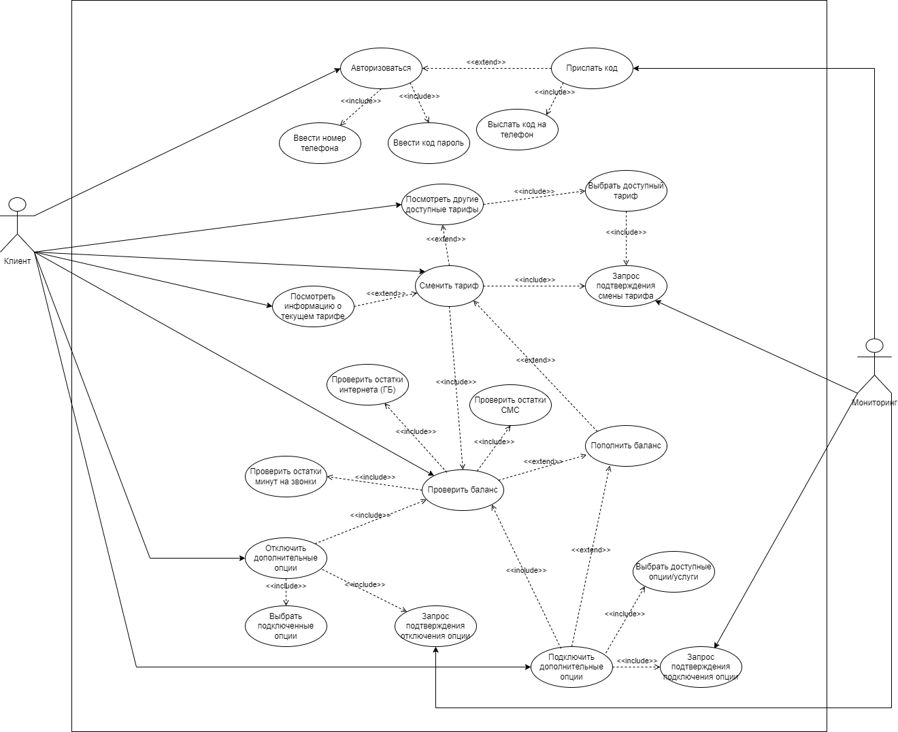
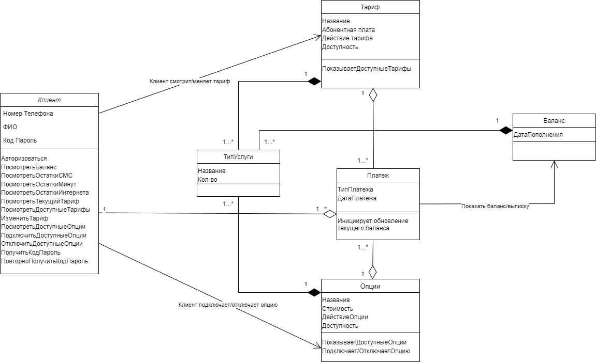

# ДИПЛОМНАЯ РАБОТА

## Тема работы: Приложение мобильной связи "Ugra-Mobile"

### Цель дипломной работы: проанализировать требования заказчика и оформить спецификацию требований на разработку программного обеспечения.

#### Контекст: Заказчик — компания, предоставляющая услуги сотовой связи физическим лицам. Необходимо разработать мобильное приложение, в котором абонент сможет проверить свой баланс, просмотреть все тарифы, изменить текущий тариф.

#### Результат 
##### Реализована спецификация требований на разработку мобильного приложения, которое предоставляет следующую функциональность: 
- авторизация по номеру телефона
- проверка баланса 
- получение информации о тарифе абонента
- получение информации о всех доступных тарифах 
- смена тарифа
- подключение/отключение дополнительных опций к тарифу

### 1. ВВЕДЕНИЕ

Данная система предназначена для абонентов мобильной связи “Ugra-mobile”. Чтобы оптимизировать работу всей системы и облегчить работу операторам связи в компании “Ugra-mobile”. Система представляет собой мобильное приложение, которое позволит абонентам:
- Просмотреть баланс;
- Узнать текущий тариф;
- Просмотреть доступные тарифы;
- Изменить тариф;
- Подключить дополнительные опции/услуги к тарифу
- Система предназначена для пользователей с операционной системой: IOS и Android.

### 2. Требования функционального характера

- ФТ001. Система должна иметь возможность отправить код-пароль для авторизации пользователя;
- ФТ002. Система должна предоставить возможность пользователю ввести код-пароль при авторизации повторно в случае, если пользователь ввел неверный код-пароль;
- ФТ003. Система должна автоматически определять регион пользователя, для отображения корректного списка доступных ему тарифов;
- ФТ004. Система должна иметь возможность хранить информацию о всех действиях клиента;
- ПТ001. Пользователь должен иметь возможность посмотреть текущий баланс в системе;
- ПТ002. Пользователь должен иметь возможность посмотреть текущий тариф;
- ПТ003. Пользователь должен иметь возможность посмотреть доступные ему тарифы;
- ПТ004. Пользователь должен иметь возможность изменить тариф;
- ПТ005. Пользователь должен иметь возможность подключить дополнительные услуги/опции;
- ПТ006. Пользователь должен иметь возможность посмотреть остатки по минутам звонков, гб интернета и кол-во смс.

### 3. Требования нефункционального характера

- О001. Система должна работать на операционных системах IOS и Android;
- СТ001. Система должна обрабатывать 4000 одновременных запросов с временем отклика, не превышающим 3 сек. Максимальное время ожидания абонентом обработки своего запроса (без учета задержки до серверов) составляет 5 секунд;
- СТ002. Система должна быть функционирующей 99,9% времени, то есть простаивать не более 9 часов в год;
- АК001. Пользователь системы имеет доступ к информации, доступной для его класса;
- СТ003. Графические интерфейсы должны выводить сообщение об ошибке в случае возникновения некорректных или ошибочных действий системы;
- СТ004. Графические интерфейсы должны быть защищены от несанкционированных и нетипичных действий пользователя;
- АК002. Все данные системы, в том числе базы данных, а также программный и исполняемый код компонентов системы должны иметь две резервные копии;
- АК003. Резервное копирование данных должно осуществляться во время наименьшей нагрузки на систему (с 03:00 до 06:00 по местному времени нахождения сервера) каждый день;
- СТ005. Система мониторинга системы должна обнаруживать аномальную сетевую активность, аномальную активность приложений, сообщать об обнаруженных угрозах администратору и принимать меры по предотвращению такой активности;
- АК004. При открытии приложения, пользователь должен видеть на главной странице свой текущий баланс;
- АК005. При открытии приложения, пользователь должен видеть на главной странице свой текущий тариф;
- СТ006. При открытии вкладки “дополнительные опции/услуги”, система должна предоставить список доступных опций абонентку;
- СТ007. При открытии вкладки “сменить тариф”, система должна предоставить список доступных тарифов абоненту.

### 4. Use case и User story

### 4.1 Сменить тариф

#### UС-UM-1: Сменить тариф.

#### Краткое описание: Абонент меняет тариф.

#### Действующие лица: Клиент.

#### Триггер: Клиент нажимает кнопку “сменить тариф”. 

#### Предусловия: Клиент абонент мобильной связи Ugra-Mobile. Абонент авторизован в системе. 

1. Система предлагает список доступных ему тарифов.
2. Клиент читает условия и описание тарифов.
3. Клиент выбирает подходящий ему тариф.
4. Если оплата по текущему тарифу прошла более 7 дней назад, то система переходит на следующий шаг.
5. Система запрашивает подтверждение на смену тарифа.
6. Система списывает деньги со счета для оплаты тарифа.
7. Если у клиента хватает денежных средств на счету для оплаты тарифы, то система переходит на следующий шаг. 
8. Система отправляет СМС-уведомление о смене тарифного плана. 
9. Система благодарит клиента за пользования услугами компании.
10. Вариант использования завершает свою работу.

#### Альтернативный поток:
4а. Списание средств произошло менее 7 дней назад.
1. Система оповещает клиента, о смене тарифного плана в следующем месяце.
2. Система переходит на шаг 8 основного потока.

7a. Не хватает средств на балансе.
1. Система оповещает клиента о недостаточности средств для оплаты тарифа.
2. Система предлагает пополнить баланс.
3. Если клиент пополняет баланс, то шаг переходит на 8 основного потока.

#### Поток исключения:
3b. Клиент отказывается пополнять баланс
1. Вариант использования завершает свою работу.

#### Постусловие: Клиент меняет тариф.
#### Результат: В случае успешного выполнения основного потока, клиент меняет тарифный план.

### 4.2 Авторизоваться по номеру телефона

#### UС-UM-2: Авторизация по номеру телефона.
#### Краткое описание: Абонент проходит авторизацию в мобильном приложении.
#### Действующие лица: Клиент.
#### Триггер: Клиент нажимает кнопку “Авторизоваться”. 
#### Предусловия: Клиент пользователь мобильной связи Ugra-Mobile. Клиент имеет мобильное приложение.
1. Система предлагает авторизоваться клиенту.
2. Клиент набирает номер телефона для авторизации.
3. Если система номер телефона введен верно, то система переходит на следующий шаг.
4. Клиент нажимает кнопку “Отправить код-пароль”.
5. Система отправляет код-пароль клиенту.
6. Если клиенту приходит код-пароль, то система переходит на следующий шаг. 
7. Клиент вводит код-пароль в системе.
9. Если клиент вводит код-пароль правильно, то система переходит на следующий шаг. 
10. Система приветствует пользователя.
11. Вариант использования завершает свою работу.

####Альтернативный поток:
3а. Номер введен неверно. 
1. Система оповещает клиента, о том что такого пользователя не существует.
5. Система переходит на шаг 1 основного потока.

6a. Не пришел код-пароль 
1. Система проверяет кол-во попыток ввода код-пароля.
2. Если кол-во попыток меньше трех, то система предлагает отправить код повторно. 
2. Система предлагает отправить код повторно через 30 секунд.
3. Клиент нажимает кнопку “Отправить код повторно”.
5. Система увеличивает кол-во попыток ввода код-пароля на 1. 
4. Система переходит на шаг 7 основного потока

#### Поток исключения:
2а. Кол-во попыток больше трех.
1. Вариант использования завершает свою работу.

8а. Клиент вводит код-пароль не верно
1. Система отображает о неправильно введенном код-пароле.
2. Система предлагает заново ввести код-пароль.
3. Клиент вновь вводит код-пароль.
4. Вводит код-пароль 3 раза подряд неправильно. 
5. Система блокирует попытки входа на 4 часа. 
6. Вариант использования завершает свою работу.

#### Постусловие: Клиент прошел авторизацию
#### Результат: В случае успешного выполнения основного потока, клиент проходит авторизацию в мобильном приложении.

### 5. Diagramm classes 

### 6. Описание API

[Swagger-документация](https://app.swaggerhub.com/apis/zorki2020/CH3/1.0)

#### Rate
| Поле (атрибут) | Тип  | Описание |
| :----- | :-: | :- |
| rate_id | int | Идентификатор тарифа |
| name_rate | string | Название тарифа |
| action | string | Действие |
| availability_rate | boolean | Доступность тарифа |
| price_rate | string | Список тарифов |

#### Balance
| Поле (атрибут) | Тип  | Описание |
| :----- | :-: | :- |
| check_id | int | Идентификатор баланса |
| replenishment_date | string | Дата пополнения |
| amount_of_money | number | Оставшееся количество денег |
| subscriber_id | int | Идентификатор абонента |
| Service_type | string | Типы услуг |
| amount_service_type | int | Кол-во типов услуг |

#### Options
| Поле (атрибут) | Тип  | Описание |
| :----- | :-: | :- |
| option_id | int | Идентификатор опции |
| name_option | string | Имя опции |
| price_option | int | Список опций |
| action | string | Действие |
| availability_option | boolean | Доступность опции |

#### Service_type
| Поле (атрибут) | Тип  | Описание |
| :----- | :-: | :- |
| name_service | string | Название услуги |
| id_service | int | Идентификатор услуги |
| amount | string | Кол-во услуг |

#### Client
| Поле (атрибут) | Тип  | Описание |
| :----- | :-: | :- |
| subscriber_id | int | Идентификатор абонента |
| first name | string | Имя пользователя |
| last name | string | Фамилия пользователя |
| code | int | Код-пароль |
| current_rate | string | Текущий тариф |
| option_id | int | Идентификатор опции |

#### Payment
| Поле (атрибут) | Тип  | Описание |
| :----- | :-: | :- |
| payment_id | int | Идентификатор платежа |
| payment_type | string | Тип платежа |
| replenishment_date | string | Дата пополнения |
| balance_id | int | Идентификатор баланса |
| rate_id | int | Идентификатор тарифа |
| subscriber_id | int | Идентификатор абонента |
| option_id | int | Идентификатор опции |

### 6.1 Взаимодействие с API
Взаимодействовать с API будут:
- Клиент
- Тариф
- Баланс
- Опции

### 6.2 Действия API
API будет выполнять следующие действия:
- Получить информацию о текущем балансе;
- Изменить текущий тариф на доступный;
- Получить список всех доступных тарифов;
- Получить список всех доступных опций

### 6.3 Методы использования API

| Действие, которое будет выполнять API | HTTP метод |
| :----- | :-: |
| Получить информацию о текущем балансе | GET | 
| Изменить текущий тариф на доступный | PUT | 
| Получить список всех доступных опций | GET | 
| Получить список всех доступных тарифов | GET |

### 6.3 Параметры запроса

#### PUT /Client

Изменить текущий тариф абонента на доступный

Запрос:
1. rate_id
2. subscriber_id

Ответ:
1. 200 OK

#### GET /balance

Получить информацию о текущем балансе

Запрос:
1. check_id
2. subscriber_id

Ответ:
1. amount_of_money
2. subscriber_id
3. replenishment_date

#### GET /Options

Получить список всех доступных опций

Запрос:
1. availability_option

Ответ:
1. name_option
2. option_id
3. price_option

#### GET /Rate

Получить список всех доступных тарифов

Запрос:
1. availability_rate 

Ответ:
1. rate_id
2. name_rate
3. price_rate

### 7. Спецификация требований [SRS](SRS.pdf)

